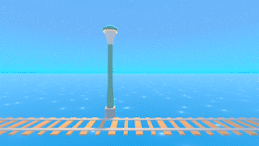

<p align="center">
  <h1 align="center">Pluvi - All In One Season Manager</h1>
  <h2 align="center">Created by Will Dye | Work In Progress</h2>
  <p align=center>  </p>
  <p align="center">
    
    
    
    
  </p>
</p>

## Table Of Contents

<details>
<summary>Details</summary>

- [Introduction](#introduction)
- [Features](#features)
- [Installation](#installation)
- [Whats Next](#whats-next)
- [Service Locator](#service-locator)
  - [Theory](#locator-theory)
  - [Use](#locator-use)
- [Messaging Bus](#messaging-bus)
  - [Theory](#bus-theory)
  - [Use](#bus-use)
- [Introduction to Pluvi Assets](#asset-introduction)
  - [Season](#season)
  - [Day](#day)
  - [Weather](#weather)
- [Additional](#additional)
  - [License](#license)
</details>

# Introduction

Pluvi is a modular service system that allows a lightweight highly performant solution to weather and seasons. Built for the unity engine, it turns any scene into a dynamic environment. Pluvi can then piece the parts together via a messaging bus that allows for the extension of the asset. The current version is a major refactor of the original version that was written in 2021 and is an indepth look into how a service locator and messaging bus could work in a unity project.

If you have found a bug or have a suggestion, you are welcome to create an issue on the https://github.com/Unany/pluvi

# Features
* Service Locator
    * Attach services by instance or component
* Messaging Bus
    * Subscribe to messages
    * Dispatch messages
* Celestial Service
    * Instantiate the main light, sun and moon
    * Control the sun and moons rotation
* Days Service
    * Get day & night assets
* Weather Service
    * Spawn weather effects on the camera or at a world position
* Skybox Service
    * Modify custom sky shader
* Time Service
   * Dispatch messages on minute, hour, day, sunrise & sunset
   * Track current time of day
* Season Service
    * Trigger new seasons

# Installation 

[](https://github.com/unany/pluvi/releases)

Please clone the repo and open it in Unity. The current version is <b>2022.2.13f1</b>

The test scene is located in the assets and is called demo. All Season, day & weather assets are located in the resources folder. Merely, press play and the bootstrapper will do the rest.

# Whats Next
The following are planned for the asset:
- Clean UI interface to create scriptable objects
- Unit tests
- Refactored clouds
- More demo scenes

# Service Locator
## Theory


<i>The service locator pattern is a design pattern used in software development to encapsulate the processes involved in obtaining a service with a strong abstraction layer. This pattern uses a central registry known as the “service locator” which on request returns the information necessary to perform a certain task.</i> -zuluonezero
[Link to source](https://www.geeksforgeeks.org/service-locator-pattern)  

Below is an example of how to use the service locator in Pluvi. Specifically built for Unity it allows for you to register components in order for services to utilise the monobehaviour lifecycle.


## Use

```csharp
using Mosuva.Messaging.Core;
using Mosuva.Pluvi.Services.Timing;

namespace Mosuva.Pluvi.Services.Core
{
    public static class Bootstrapper
    {
        [RuntimeInitializeOnLoadMethod(RuntimeInitializeLoadType.BeforeSceneLoad)]
        public static void Initialise()
        {
            ServiceLocator serviceLocator = ServiceLocator.Instance;

            serviceLocator.RegisterComponent<MessagingService>(new MessagingService());
            serviceLocator.RegisterComponent<TimeService>(new TimeService());
        }
    }
}
```
```csharp
using Mosuva.Pluvi.Services.Core;

namespace Mosuva.Pluvi.Services.Timing
{
    public interface ITimeService : IService
    {
    }
}
```

# Messaging Bus
## Theory


<i>How to make use of a message bus in Unity. This is a good solution to decouple components and logically organise how your game runs. Instead of doing all the dragging in the editor of game objects and components into scripts the message bus works a bit like a proxy for the communication between scripts... When using Events your Objects become Subscribers and Publishers of actions. When you subscribe (or listen) to a particular event channel you get notified when something changes. These notifications go out to every object that is listening on the bus and each object script can respond to the message in their own way.</i> -zuluonezero
[Link to source](https://www.zuluonezero.net/2022/02/15/unity-message-bus/)  

Below is an example of how to use the messaging bus in Pluvi. There is currently a fair bit of boilerplate which will be looked into at a later date.

## Use

```csharp
using UnityEngine;

namespace Mosuva.Pluvi.Services.Timing
{
    public struct OnSunrise
    {
        public TimeData Time;
    }
}
```
```csharp
public class TimeService : MonoBehaviour, IService, IDispatch<OnSunrise>
{
    private OnSunrise onSunrise = new OnSunrise();
    
    public void HandleTransmitMessage(OnSunrise message)
    {
        ServiceLocator.Instance.Get<MessagingService>().Dispatch(message);
    }

    private void CheckIfSunrise()
    {
        if (!dayTimeTriggered && time.CurrentTimeOfDay > time.DayTimeValue)
        {
            HandleTransmitMessage(onSunrise);
            dayTimeTriggered = true;
        }
    }
}
```
```csharp
public class Lamp : MonoBehaviour, ISubscribe<OnSunrise>, ISubscribe<OnSunset>
{
    [SerializeField]
    private GameObject pointLight;
    private MessagingService messagingService;

    public void OnEnable()
    {   
        messagingService = ServiceLocator.Instance.Get<MessagingService>();
        messagingService.Subscribe<OnSunrise>(this);
        messagingService.Subscribe<OnSunset>(this);
    }

    public void Execute(OnSunrise message)
    {
        pointLight.SetActive(false);
    }

    public void Execute(OnSunset message)
    {
        pointLight.SetActive(true);
    }

    private void OnDisable()
    {
        messagingService.Unsubscribe<OnSunrise>(this);
        messagingService.Unsubscribe<OnSunset>(this);
    }
}
```

# Introduction to Pluvi Assets
Assets are used by the modules to create the desired effect. For now they're located in scriptable objects and can be swapped via the tab menu Assets -> Create -> Pluvi

Below are an example of the configs. NOTE: This is currently in progress and more documentation will follow on the fields.
## Season


## Day


## Weather


# Additional
## License
Pluvi is currently under <i>all rights reserved</i>
